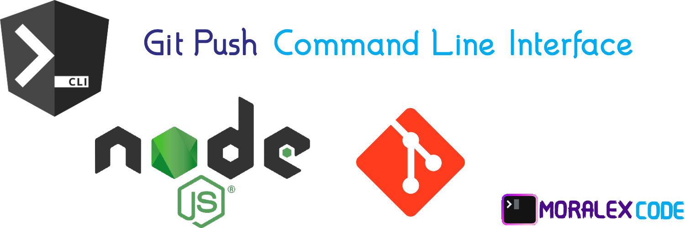
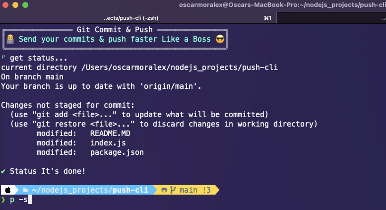
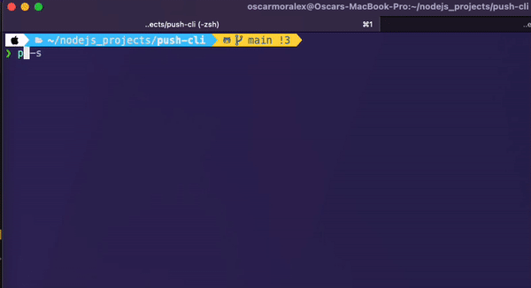
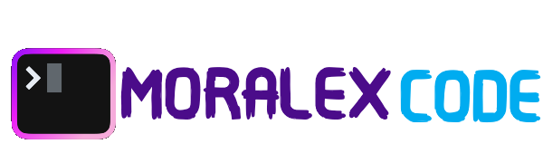

# Git Push CLI

This app going to help to take control to your activities following GTD method

To create a NodeJS project, you can follow these steps:



# Feature

    ✓  📈 git status
    ✓  🤯 git add .
    ✓  ⌨️ git commit -m`${comments}`
    ✓  📦 git push
    ✓  ❯ git status & git add . & git commit -m `${comments}` & git push
    ✓  👨‍💻 This tool is powered by MoralexCode

<br>

## ⬇️ Install

```sh

npm i @oscarmoralex/push-cli -g

npm link # some times need execute like sudo user

```

<br>


run this comand to add new Task:

```sh
# answer the questions
p status
#or
p -s
```



**Run this command to commit :**

```sh
# To commit
p commit 'Initial commit  by  ❯ ❯ MoralexCode 😎 ❮ ❮'
```

**Run this command to push to remote repository :**

```sh
# Doing push to remote repository
p push 'Initial commit  by  ❯ ❯ MoralexCode 😎 ❮ ❮'
# if you have your change commited, just send like this
p push
```

run this comand to get command helps:

```sh
# show all commands & flags
p help
```

# License

MIT

# Questions

doubts, comments and support, please contact me  by email : [oscarmorales.fullstackdeveloper@gmail.com](oscarmorales.fullstackdeveloper@gmail.com)

 [OSCAR MORALES](https://www.linkedin.com/in/oscar-morales-garcia/)


